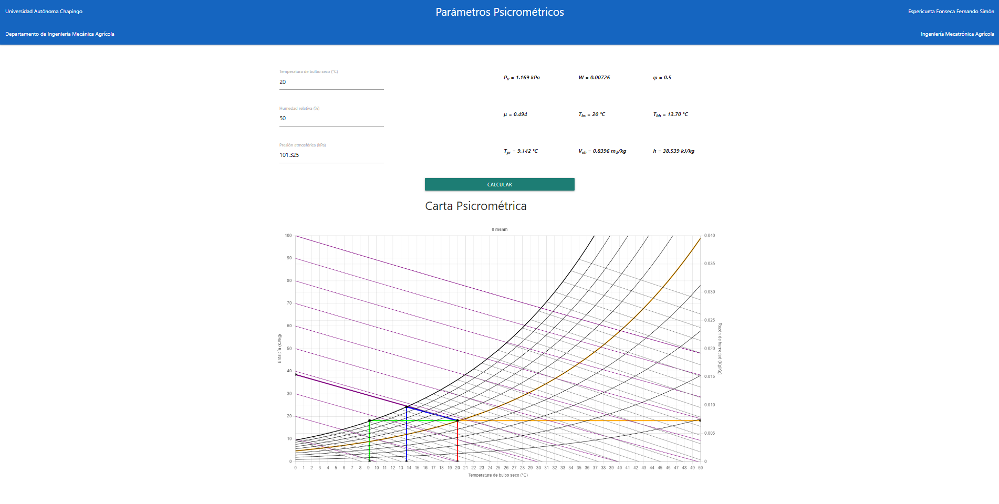

# Psychrometric Chart

This was a final project used to plot the psychrometric parameters of dry air given 
temperature, relative humidity, and atmospheric pressure. 

## Requirements

This project requires the following Framework:
- [Materialize](https://materializecss.com/getting-started.html)
- [ChartJS](https://www.chartjs.org/docs/latest/)

## Site
- [Web Page](https://parametros-psicrometricos-del-aire-se.netlify.app/)